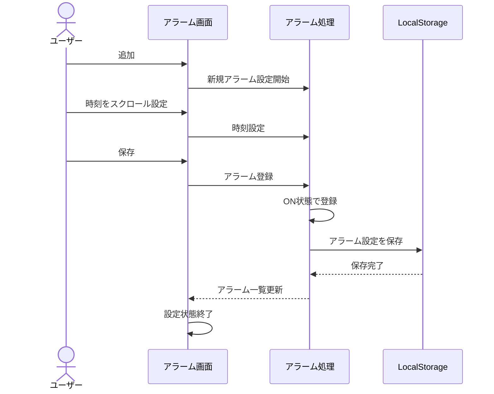
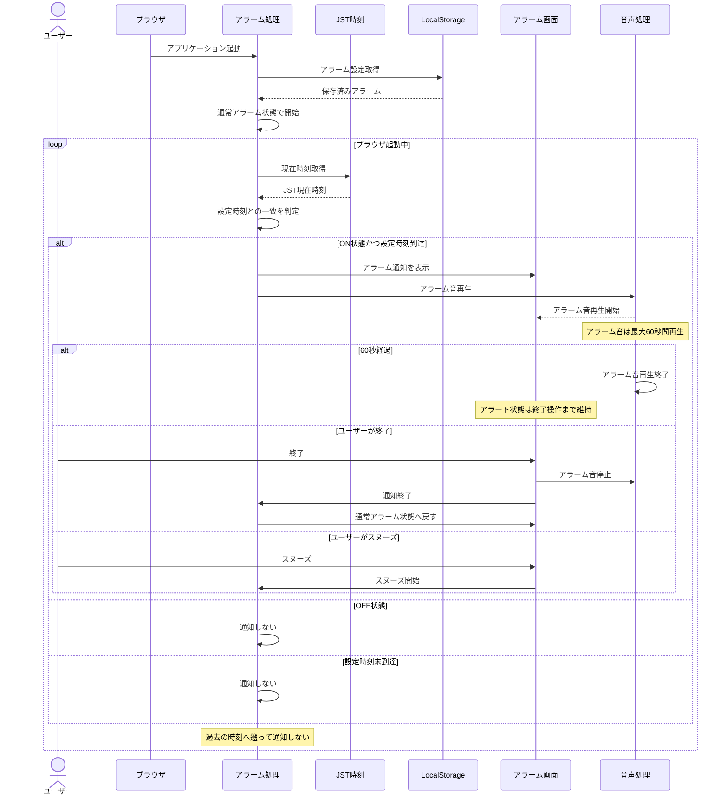
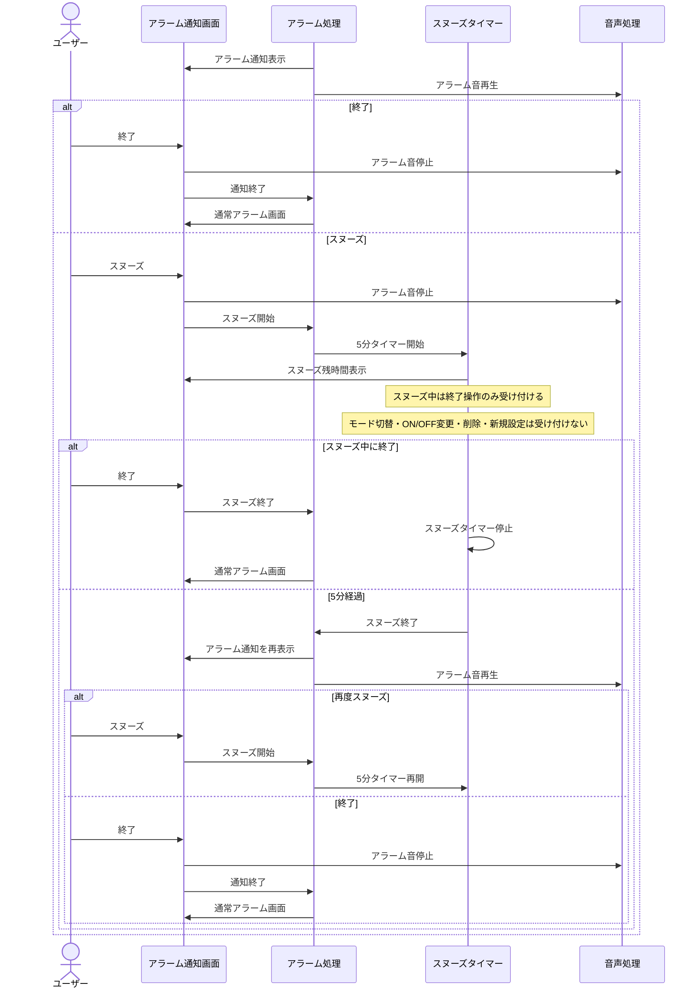
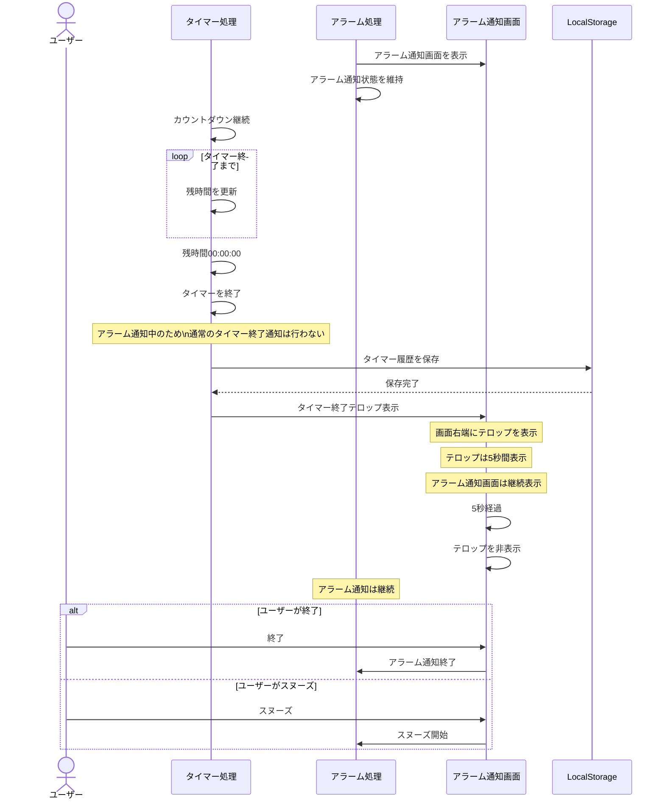
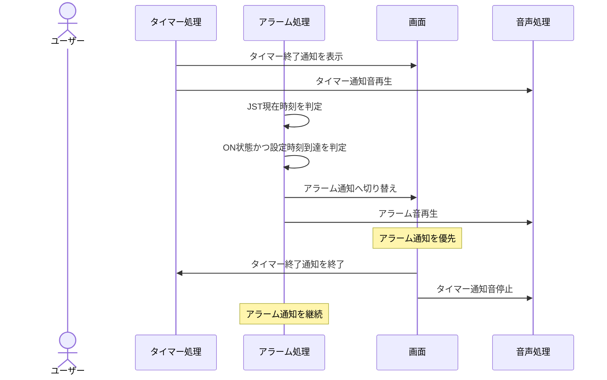

# アラームシーケンス図

## 1. アラーム登録

```mermaid
sequenceDiagram
    actor ユーザー
    participant UI as アラーム画面
    participant Alarm as アラーム処理
    participant Storage as LocalStorage

    ユーザー->>UI: 追加
    UI->>Alarm: 新規アラーム設定開始

    ユーザー->>UI: 時刻をスクロール設定
    UI->>Alarm: 時刻設定

    ユーザー->>UI: 保存
    UI->>Alarm: アラーム登録
    Alarm->>Alarm: ON状態で登録
    Alarm->>Storage: アラーム設定を保存
    Storage-->>Alarm: 保存完了
    Alarm-->>UI: アラーム一覧更新

    UI->>UI: 設定状態終了
```

## 2. アラーム通知

```mermaid
sequenceDiagram
    actor ユーザー
    participant Browser as ブラウザ
    participant Alarm as アラーム処理
    participant Clock as JST時刻
    participant Storage as LocalStorage
    participant UI as アラーム画面
    participant Audio as 音声処理

    Browser->>Alarm: アプリケーション起動
    Alarm->>Storage: アラーム設定取得
    Storage-->>Alarm: 保存済みアラーム
    Alarm->>Alarm: 通常アラーム状態で開始

    loop ブラウザ起動中
        Alarm->>Clock: 現在時刻取得
        Clock-->>Alarm: JST現在時刻
        Alarm->>Alarm: 設定時刻との一致を判定

        alt ON状態かつ設定時刻到達
            Alarm->>UI: アラーム通知を表示
            Alarm->>Audio: アラーム音再生
            Audio-->>UI: アラーム音再生開始

            Note over Audio: アラーム音は最大60秒間再生

            alt 60秒経過
                Audio->>Audio: アラーム音再生終了
                Note over UI: アラート状態は終了操作まで維持
            else ユーザーが終了
                ユーザー->>UI: 終了
                UI->>Audio: アラーム音停止
                UI->>Alarm: 通知終了
                Alarm->>UI: 通常アラーム状態へ戻す
            else ユーザーがスヌーズ
                ユーザー->>UI: スヌーズ
                UI->>Alarm: スヌーズ開始
            end

        else OFF状態
            Alarm->>Alarm: 通知しない

        else 設定時刻未到達
            Alarm->>Alarm: 通知しない
        end

        Note over Alarm: 過去の時刻へ遡って通知しない
    end
```

## 3. アラーム通知～スヌーズ

```mermaid
sequenceDiagram
    actor ユーザー
    participant UI as アラーム通知画面
    participant Alarm as アラーム処理
    participant Snooze as スヌーズタイマー
    participant Audio as 音声処理

    Alarm->>UI: アラーム通知表示
    Alarm->>Audio: アラーム音再生

    alt 終了
        ユーザー->>UI: 終了
        UI->>Audio: アラーム音停止
        UI->>Alarm: 通知終了
        Alarm->>UI: 通常アラーム画面

    else スヌーズ
        ユーザー->>UI: スヌーズ
        UI->>Audio: アラーム音停止
        UI->>Alarm: スヌーズ開始
        Alarm->>Snooze: 5分タイマー開始
        Snooze->>UI: スヌーズ残時間表示

        Note over Snooze: スヌーズ中は終了操作のみ受け付ける
        Note over Snooze: モード切替・ON/OFF変更・削除・新規設定は受け付けない

        alt スヌーズ中に終了
            ユーザー->>UI: 終了
            UI->>Alarm: スヌーズ終了
            Snooze->>Snooze: スヌーズタイマー停止
            Alarm->>UI: 通常アラーム画面

        else 5分経過
            Snooze->>Alarm: スヌーズ終了
            Alarm->>UI: アラーム通知を再表示
            Alarm->>Audio: アラーム音再生

            alt 再度スヌーズ
                ユーザー->>UI: スヌーズ
                UI->>Alarm: スヌーズ開始
                Alarm->>Snooze: 5分タイマー再開
            else 終了
                ユーザー->>UI: 終了
                UI->>Audio: アラーム音停止
                UI->>Alarm: 通知終了
                Alarm->>UI: 通常アラーム画面
            end
        end
    end
```

## 4. アラーム通知中にタイマーが終了した場合

```mermaid
sequenceDiagram
    actor ユーザー
    participant Timer as タイマー処理
    participant Alarm as アラーム処理
    participant UI as アラーム通知画面
    participant Storage as LocalStorage

    Alarm->>UI: アラーム通知画面を表示
    Alarm->>Alarm: アラーム通知状態を維持

    Timer->>Timer: カウントダウン継続

    loop タイマー終了まで
        Timer->>Timer: 残時間を更新
    end

    Timer->>Timer: 残時間00:00:00
    Timer->>Timer: タイマーを終了

    Note over Timer: アラーム通知中のため\n通常のタイマー終了通知は行わない

    Timer->>Storage: タイマー履歴を保存
    Storage-->>Timer: 保存完了

    Timer->>UI: タイマー終了テロップ表示

    Note over UI: 画面右端にテロップを表示
    Note over UI: テロップは5秒間表示
    Note over UI: アラーム通知画面は継続表示

    UI->>UI: 5秒経過
    UI->>UI: テロップを非表示

    Note over Alarm: アラーム通知は継続

    alt ユーザーが終了
        ユーザー->>UI: 終了
        UI->>Alarm: アラーム通知終了
    else ユーザーがスヌーズ
        ユーザー->>UI: スヌーズ
        UI->>Alarm: スヌーズ開始
    end
```

## 5. タイマー通知中にアラーム時刻へ到達した場合

```mermaid
sequenceDiagram
    actor ユーザー
    participant Timer as タイマー処理
    participant Alarm as アラーム処理
    participant UI as 画面
    participant Audio as 音声処理

    Timer->>UI: タイマー終了通知を表示
    Timer->>Audio: タイマー通知音再生

    Alarm->>Alarm: JST現在時刻を判定
    Alarm->>Alarm: ON状態かつ設定時刻到達を判定
    Alarm->>UI: アラーム通知へ切り替え
    Alarm->>Audio: アラーム音再生

    Note over UI: アラーム通知を優先

    UI->>Timer: タイマー終了通知を終了
    UI->>Audio: タイマー通知音停止

    Note over Alarm: アラーム通知を継続
```
