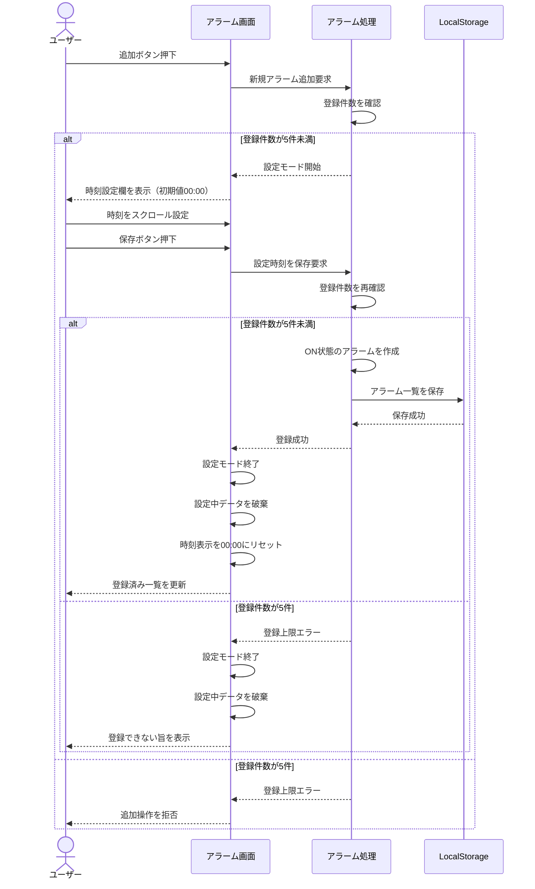
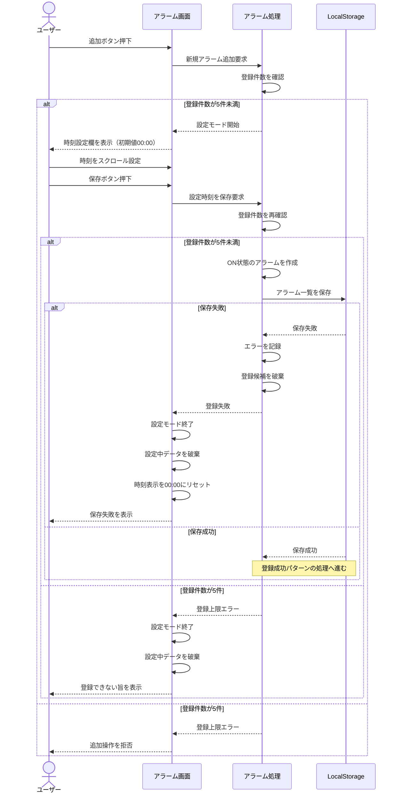
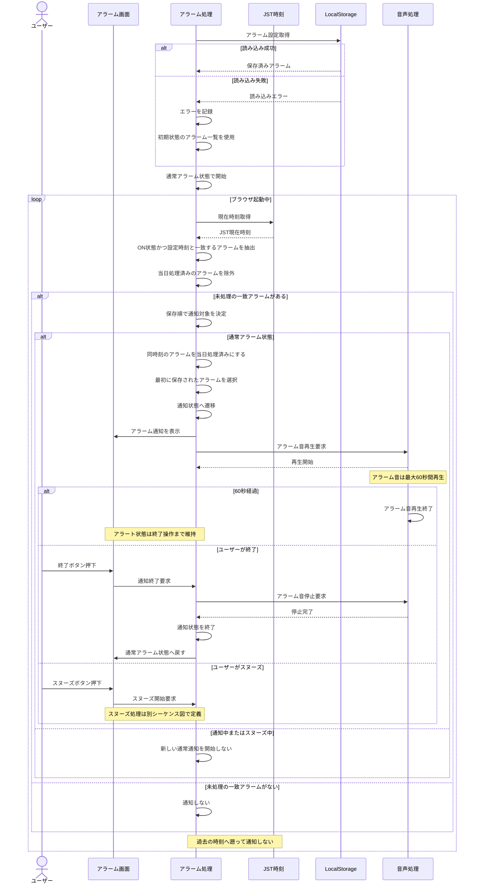
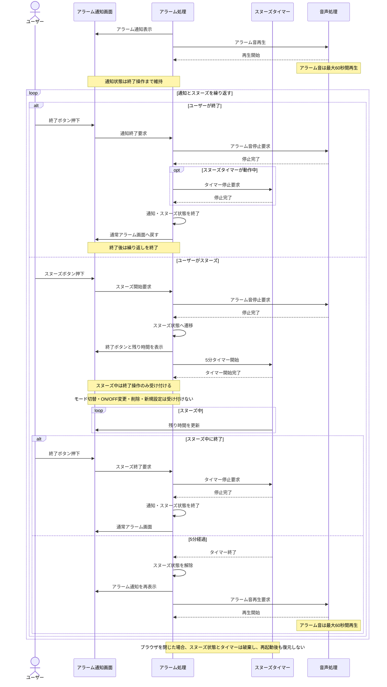
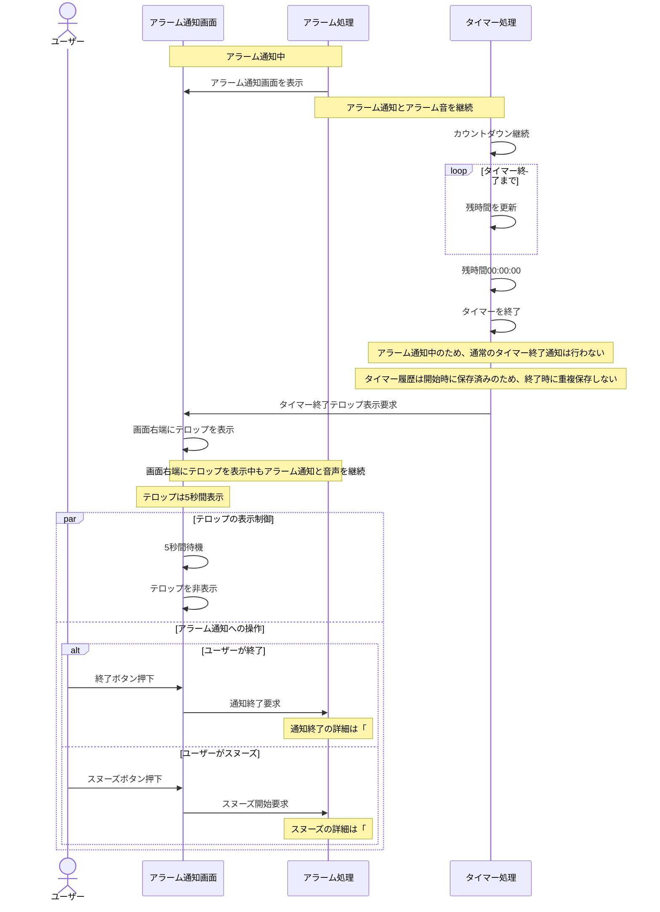
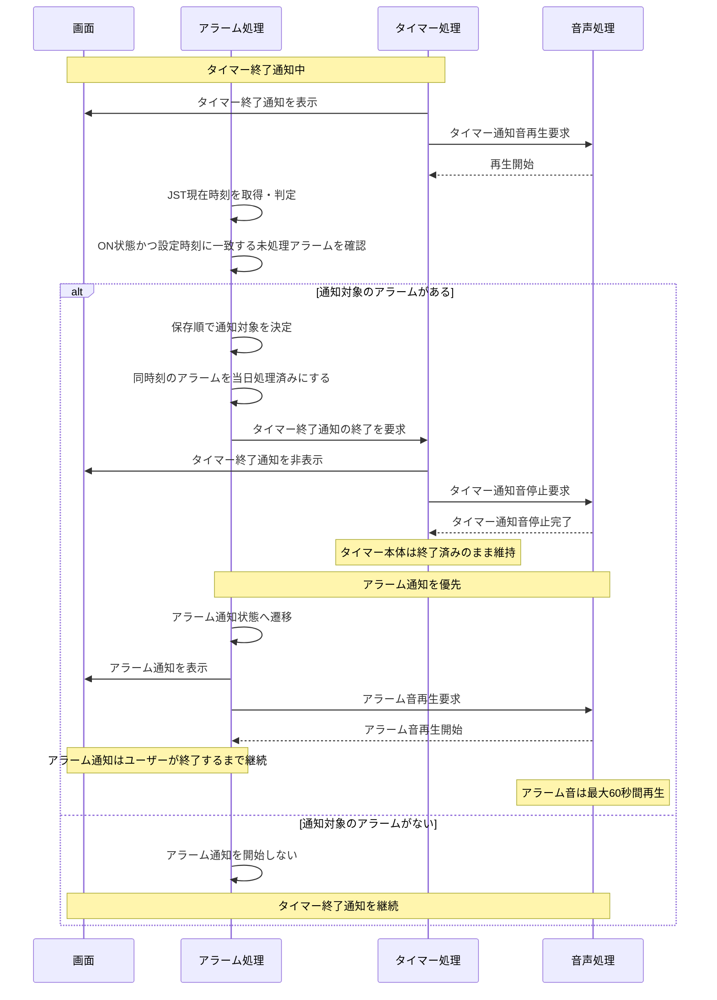

# アラームシーケンス図
## 1. アラーム登録 成功パターン

```mermaid
sequenceDiagram
    actor ユーザー
    participant UI as アラーム画面
    participant Alarm as アラーム処理
    participant Storage as LocalStorage

    ユーザー->>UI: 追加ボタン押下
    UI->>Alarm: 新規アラーム追加要求
    Alarm->>Alarm: 登録件数を確認

    alt 登録件数が5件未満
        Alarm-->>UI: 設定モード開始
        UI-->>ユーザー: 時刻設定欄を表示（初期値00:00）
        ユーザー->>UI: 時刻をスクロール設定
        ユーザー->>UI: 保存ボタン押下
        UI->>Alarm: 設定時刻を保存要求
        Alarm->>Alarm: 登録件数を再確認

        alt 登録件数が5件未満
            Alarm->>Alarm: ON状態のアラームを作成
            Alarm->>Storage: アラーム一覧を保存
            Storage-->>Alarm: 保存成功
            Alarm-->>UI: 登録成功
            UI->>UI: 設定モード終了
            UI->>UI: 設定中データを破棄
            UI->>UI: 時刻表示を00:00にリセット
            UI-->>ユーザー: 登録済み一覧を更新
        else 登録件数が5件
            Alarm-->>UI: 登録上限エラー
            UI->>UI: 設定モード終了
            UI->>UI: 設定中データを破棄
            UI-->>ユーザー: 登録できない旨を表示
        end
    else 登録件数が5件
        Alarm-->>UI: 登録上限エラー
        UI-->>ユーザー: 追加操作を拒否
    end
```

## 2. アラーム登録 失敗パターン

```mermaid
sequenceDiagram
    actor ユーザー
    participant UI as アラーム画面
    participant Alarm as アラーム処理
    participant Storage as LocalStorage

    ユーザー->>UI: 追加ボタン押下
    UI->>Alarm: 新規アラーム追加要求
    Alarm->>Alarm: 登録件数を確認

    alt 登録件数が5件未満
        Alarm-->>UI: 設定モード開始
        UI-->>ユーザー: 時刻設定欄を表示（初期値00:00）
        ユーザー->>UI: 時刻をスクロール設定
        ユーザー->>UI: 保存ボタン押下
        UI->>Alarm: 設定時刻を保存要求
        Alarm->>Alarm: 登録件数を再確認

        alt 登録件数が5件未満
            Alarm->>Alarm: ON状態のアラームを作成
            Alarm->>Storage: アラーム一覧を保存

            alt 保存失敗
                Storage-->>Alarm: 保存失敗
                Alarm->>Alarm: エラーを記録
                Alarm->>Alarm: 登録候補を破棄
                Alarm-->>UI: 登録失敗
                UI->>UI: 設定モード終了
                UI->>UI: 設定中データを破棄
                UI->>UI: 時刻表示を00:00にリセット
                UI-->>ユーザー: 保存失敗を表示
            else 保存成功
                Storage-->>Alarm: 保存成功
                Note over Alarm,Storage: 登録成功パターンの処理へ進む
            end
        else 登録件数が5件
            Alarm-->>UI: 登録上限エラー
            UI->>UI: 設定モード終了
            UI->>UI: 設定中データを破棄
            UI-->>ユーザー: 登録できない旨を表示
        end
    else 登録件数が5件
        Alarm-->>UI: 登録上限エラー
        UI-->>ユーザー: 追加操作を拒否
    end
```

## 3. アラーム通知

```mermaid
sequenceDiagram
    actor ユーザー
    participant UI as アラーム画面
    participant Alarm as アラーム処理
    participant Clock as JST時刻
    participant Storage as LocalStorage
    participant Audio as 音声処理

    Alarm->>Storage: アラーム設定取得
    alt 読み込み成功
        Storage-->>Alarm: 保存済みアラーム
    else 読み込み失敗
        Storage-->>Alarm: 読み込みエラー
        Alarm->>Alarm: エラーを記録
        Alarm->>Alarm: 初期状態のアラーム一覧を使用
    end

    Alarm->>Alarm: 通常アラーム状態で開始

    loop ブラウザ起動中
        Alarm->>Clock: 現在時刻取得
        Clock-->>Alarm: JST現在時刻
        Alarm->>Alarm: ON状態かつ設定時刻と一致するアラームを抽出
        Alarm->>Alarm: 当日処理済みのアラームを除外

        alt 未処理の一致アラームがある
            Alarm->>Alarm: 保存順で通知対象を決定

            alt 通常アラーム状態
                Alarm->>Alarm: 同時刻のアラームを当日処理済みにする

                Alarm->>Alarm: 最初に保存されたアラームを選択
                Alarm->>Alarm: 通知状態へ遷移
                Alarm->>UI: アラーム通知を表示
                Alarm->>Audio: アラーム音再生要求
                Audio-->>Alarm: 再生開始

                Note over Audio: アラーム音は最大60秒間再生

                alt 60秒経過
                    Audio->>Audio: アラーム音再生終了
                    Note over UI,Alarm: アラート状態は終了操作まで維持

                else ユーザーが終了
                    ユーザー->>UI: 終了ボタン押下
                    UI->>Alarm: 通知終了要求
                    Alarm->>Audio: アラーム音停止要求
                    Audio-->>Alarm: 停止完了
                    Alarm->>Alarm: 通知状態を終了
                    Alarm->>UI: 通常アラーム状態へ戻す
                else ユーザーがスヌーズ
                    ユーザー->>UI: スヌーズボタン押下
                    UI->>Alarm: スヌーズ開始要求
                    Note over Alarm,UI: スヌーズ処理は別シーケンス図で定義
                end

            else 通知中またはスヌーズ中
                Alarm->>Alarm: 新しい通常通知を開始しない
            end

        else 未処理の一致アラームがない
            Alarm->>Alarm: 通知しない
        end

        Note over Alarm,Clock: 過去の時刻へ遡って通知しない
    end
```

## 4. アラーム通知～スヌーズ

```mermaid
sequenceDiagram
    actor ユーザー
    participant UI as アラーム通知画面
    participant Alarm as アラーム処理
    participant Snooze as スヌーズタイマー
    participant Audio as 音声処理

    Alarm->>UI: アラーム通知表示
    Alarm->>Audio: アラーム音再生
    Audio-->>Alarm: 再生開始

    Note over Audio: アラーム音は最大60秒間再生
    Note over UI,Alarm: 通知状態は終了操作まで維持

    loop 通知とスヌーズを繰り返す

        alt ユーザーが終了
            ユーザー->>UI: 終了ボタン押下
            UI->>Alarm: 通知終了要求
            Alarm->>Audio: アラーム音停止要求
            Audio-->>Alarm: 停止完了
            opt スヌーズタイマーが動作中
                Alarm->>Snooze: タイマー停止要求
                Snooze-->>Alarm: 停止完了
            end
            Alarm->>Alarm: 通知・スヌーズ状態を終了
            Alarm->>UI: 通常アラーム画面へ戻す
            Note over Alarm,UI: 終了後は繰り返しを終了

        else ユーザーがスヌーズ
            ユーザー->>UI: スヌーズボタン押下
            UI->>Alarm: スヌーズ開始要求
            Alarm->>Audio: アラーム音停止要求
            Audio-->>Alarm: 停止完了
            Alarm->>Alarm: スヌーズ状態へ遷移
            Alarm->>UI: 終了ボタンと残り時間を表示
            Alarm->>Snooze: 5分タイマー開始
            Snooze-->>Alarm: タイマー開始完了

            Note over UI,Alarm: スヌーズ中は終了操作のみ受け付ける
            Note over UI,Alarm: モード切替・ON/OFF変更・削除・新規設定は受け付けない

            loop スヌーズ中
                Snooze->>UI: 残り時間を更新
            end

            alt スヌーズ中に終了
                ユーザー->>UI: 終了ボタン押下
                UI->>Alarm: スヌーズ終了要求
                Alarm->>Snooze: タイマー停止要求
                Snooze-->>Alarm: 停止完了
                Alarm->>Alarm: 通知・スヌーズ状態を終了
                Alarm->>UI: 通常アラーム画面

            else 5分経過
                Snooze-->>Alarm: タイマー終了
                Alarm->>Alarm: スヌーズ状態を解除
                Alarm->>UI: アラーム通知を再表示
                Alarm->>Audio: アラーム音再生要求
                Audio-->>Alarm: 再生開始
                Note over Audio: アラーム音は最大60秒間再生
            end
        end
    end

    Note over Alarm,Snooze: ブラウザを閉じた場合、スヌーズ状態とタイマーは破棄し、再起動後も復元しない
```

## 5. アラーム通知中にタイマーが終了した場合

```mermaid
sequenceDiagram
    actor ユーザー
    participant UI as アラーム通知画面
    participant Alarm as アラーム処理
    participant Timer as タイマー処理

    Note over UI,Alarm: アラーム通知中
    Alarm->>UI: アラーム通知画面を表示
    Note over Alarm,Timer: アラーム通知とアラーム音を継続

    Timer->>Timer: カウントダウン継続

    loop タイマー終了まで
        Timer->>Timer: 残時間を更新
    end

    Timer->>Timer: 残時間00:00:00
    Timer->>Timer: タイマーを終了

    Note over Timer: アラーム通知中のため、通常のタイマー終了通知は行わない
    Note over Timer: タイマー履歴は開始時に保存済みのため、終了時に重複保存しない

    Timer->>UI: タイマー終了テロップ表示要求
    UI->>UI: 画面右端にテロップを表示

    Note over UI,Alarm: 画面右端にテロップを表示中もアラーム通知と音声を継続
    Note over UI: テロップは5秒間表示

    par  テロップの表示制御
        UI->>UI: 5秒間待機
        UI->>UI: テロップを非表示
    and アラーム通知への操作
        alt ユーザーが終了
            ユーザー->>UI: 終了ボタン押下
            UI->>Alarm: 通知終了要求
            Note over Alarm: 通知終了の詳細は「## 4」で定義
        else ユーザーがスヌーズ
            ユーザー->>UI: スヌーズボタン押下
            UI->>Alarm: スヌーズ開始要求
            Note over Alarm: スヌーズの詳細は「## 4」で定義
        end
    end
```

## 6. タイマー通知中にアラーム時刻へ到達した場合

```mermaid
sequenceDiagram
    participant UI as 画面
    participant Alarm as アラーム処理
    participant Timer as タイマー処理
    participant Audio as 音声処理

    Note over UI,Timer: タイマー終了通知中

    Timer->>UI: タイマー終了通知を表示
    Timer->>Audio: タイマー通知音再生要求
    Audio-->>Timer: 再生開始

    Alarm->>Alarm: JST現在時刻を取得・判定
    Alarm->>Alarm: ON状態かつ設定時刻に一致する未処理アラームを確認

    alt 通知対象のアラームがある
        Alarm->>Alarm: 保存順で通知対象を決定
        Alarm->>Alarm: 同時刻のアラームを当日処理済みにする

        Alarm->>Timer: タイマー終了通知の終了を要求
        Timer->>UI: タイマー終了通知を非表示
        Timer->>Audio: タイマー通知音停止要求
        Audio-->>Timer: タイマー通知音停止完了

        Note over Timer: タイマー本体は終了済みのまま維持
        Note over Alarm,Audio: アラーム通知を優先

        Alarm->>Alarm: アラーム通知状態へ遷移
        Alarm->>UI: アラーム通知を表示
        Alarm->>Audio: アラーム音再生要求
        Audio-->>Alarm: アラーム音再生開始

        Note over UI,Alarm: アラーム通知はユーザーが終了するまで継続
        Note over Audio: アラーム音は最大60秒間再生

    else 通知対象のアラームがない
        Alarm->>Alarm: アラーム通知を開始しない
        Note over UI,Audio: タイマー終了通知を継続
    end
```
