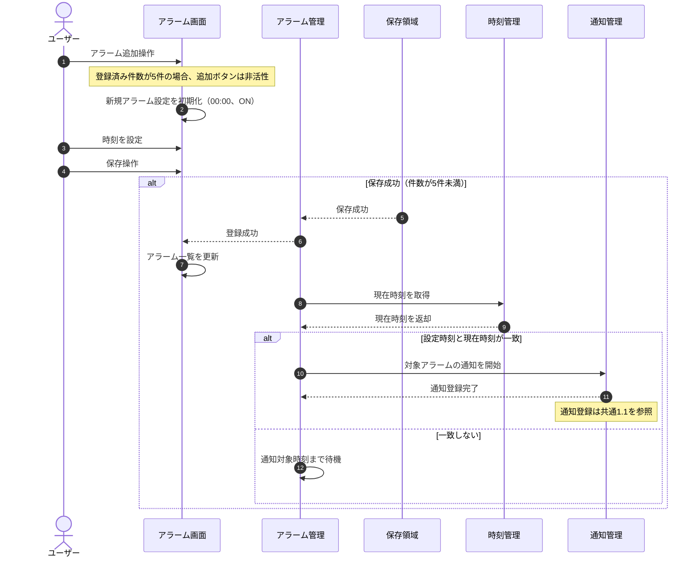
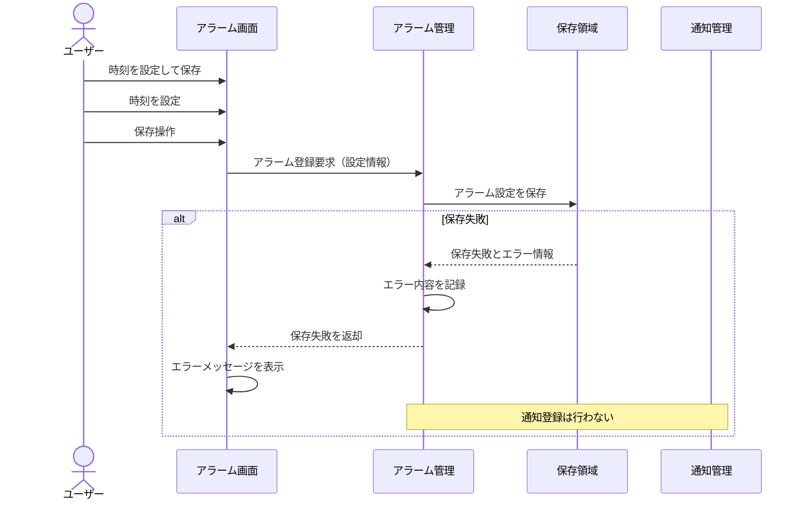
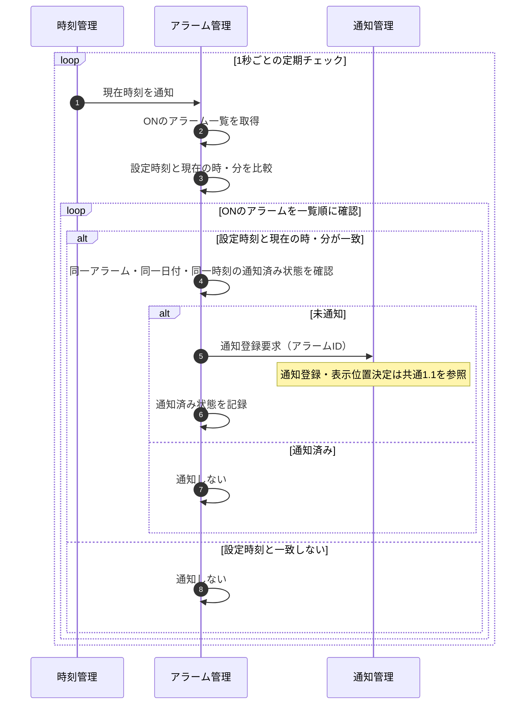
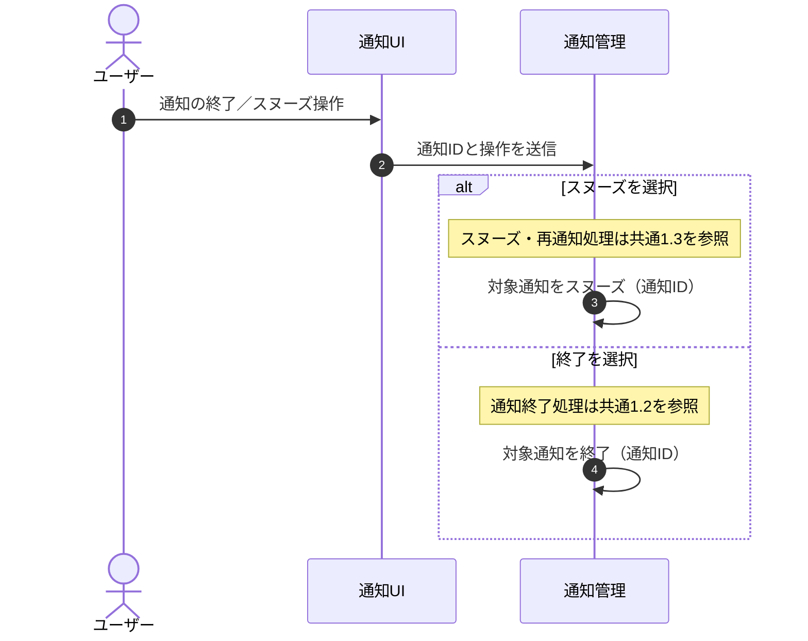
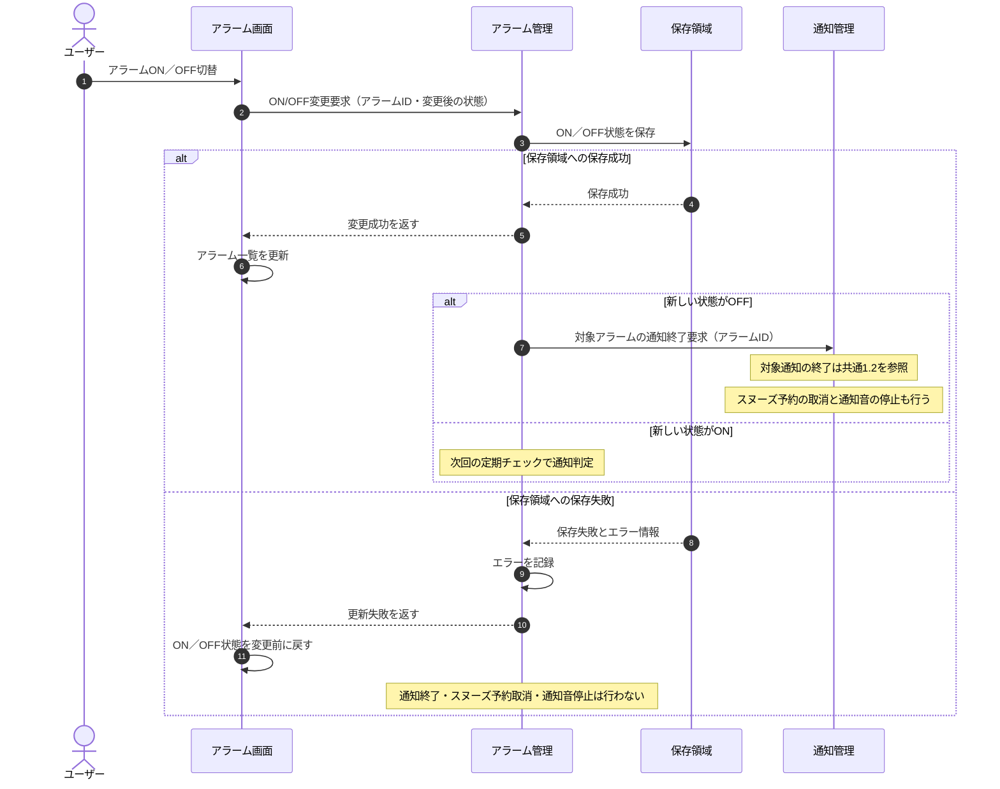
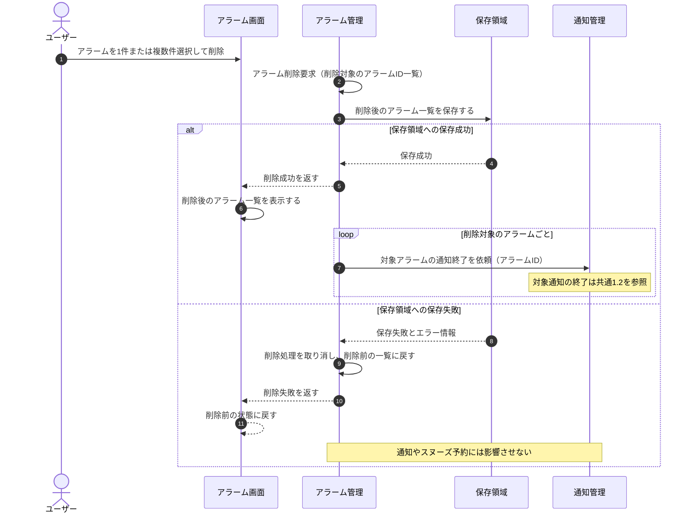

# アラームシーケンス図
## 1. アラーム登録 成功パターン

```mermaid
sequenceDiagram
    autonumber
    actor User as ユーザー
    participant UI as アラーム画面
    participant Alarm as アラーム管理
    participant Storage as 保存領域
    participant Clock as 時刻管理
    participant Notify as 通知管理

    User->>UI: アラーム追加操作
    Note over UI: 登録済み件数が5件の場合、追加ボタンは非活性

    UI->>UI: 新規アラーム設定を初期化（00:00、ON）
    User->>UI: 時刻を設定
    User->>UI: 保存操作

    alt 保存成功（件数が5件未満）
        Storage-->>Alarm: 保存成功
        Alarm-->>UI: 登録成功
        UI->>UI: アラーム一覧を更新

        Alarm->>Clock: 現在時刻を取得
        Clock-->>Alarm: 現在時刻を返却

        alt 設定時刻と現在時刻が一致
            Alarm->>Notify: 対象アラームの通知を開始
            Notify-->>Alarm: 通知登録完了
            Note over Notify: 通知登録は共通1.1を参照
        else 一致しない
            Alarm->>Alarm: 通知対象時刻まで待機
        end
    end
```

## 2. アラーム登録 失敗パターン

```mermaid
sequenceDiagram
    actor User as ユーザー
    participant UI as アラーム画面
    participant Alarm as アラーム管理
    participant Storage as 保存領域
    participant Notify as 通知管理

    User->>UI: 時刻を設定して保存
    User->>UI: 時刻を設定
    User->>UI: 保存操作

    UI->>Alarm: アラーム登録要求（設定情報）
    Alarm->>Storage: アラーム設定を保存

    alt 保存失敗
        Storage-->>Alarm: 保存失敗とエラー情報
        Alarm->>Alarm: エラー内容を記録
        Alarm-->>UI: 保存失敗を返却
        UI->>UI: エラーメッセージを表示

        Note over Alarm,Notify: 通知登録は行わない
    end
```

## 3. アラーム通知

```mermaid
sequenceDiagram
    autonumber
    participant Clock as 時刻管理
    participant Alarm as アラーム管理
    participant Notify as 通知管理

    loop 1秒ごとの定期チェック
        Clock->>Alarm: 現在時刻を通知
        Alarm->>Alarm: ONのアラーム一覧を取得
        Alarm->>Alarm: 設定時刻と現在の時・分を比較

        loop ONのアラームを一覧順に確認
            alt 設定時刻と現在の時・分が一致
                Alarm->>Alarm: 同一アラーム・同一日付・同一時刻の通知済み状態を確認

                alt 未通知
                    Alarm->>Notify: 通知登録要求（アラームID）
                    Note over Notify: 通知登録・表示位置決定は共通1.1を参照
                    Alarm->>Alarm: 通知済み状態を記録
                else 通知済み
                    Alarm->>Alarm: 通知しない
                end
            else 設定時刻と一致しない
                Alarm->>Alarm: 通知しない
            end
        end
    end
```

## 4. アラーム通知の終了・スヌーズ操作

```mermaid
sequenceDiagram
    autonumber
    actor User as ユーザー
    participant UI as 通知UI
    participant Notify as 通知管理

    User->>UI: 通知の終了／スヌーズ操作
    UI->>Notify: 通知IDと操作を送信

    alt スヌーズを選択
        Note over Notify: スヌーズ・再通知処理は共通1.3を参照
        Notify->>Notify: 対象通知をスヌーズ（通知ID）
    else 終了を選択
        Note over Notify: 通知終了処理は共通1.2を参照
        Notify->>Notify: 対象通知を終了（通知ID）
    end
```

## 5. アラームON/OFF切替

```mermaid
sequenceDiagram
    autonumber
    actor User as ユーザー
    participant UI as アラーム画面
    participant Alarm as アラーム管理
    participant Storage as 保存領域
    participant Notify as 通知管理

    User->>UI: アラームON／OFF切替
    UI->>Alarm: ON/OFF変更要求（アラームID・変更後の状態）
    Alarm->>Storage: ON／OFF状態を保存

    alt 保存領域への保存成功
        Storage-->>Alarm: 保存成功
        Alarm-->>UI: 変更成功を返す
        UI->>UI: アラーム一覧を更新

        alt 新しい状態がOFF
            Alarm->>Notify: 対象アラームの通知終了要求（アラームID）
            Note over Notify: 対象通知の終了は共通1.2を参照
            Note over Notify: スヌーズ予約の取消と通知音の停止も行う
        else 新しい状態がON
            Note over Alarm: 次回の定期チェックで通知判定
        end

    else 保存領域への保存失敗
        Storage-->>Alarm: 保存失敗とエラー情報
        Alarm->>Alarm: エラーを記録
        Alarm-->>UI: 更新失敗を返す
        UI->>UI: ON／OFF状態を変更前に戻す

        Note over Alarm: 通知終了・スヌーズ予約取消・通知音停止は行わない
    end
```

## 6. アラーム削除

```mermaid
sequenceDiagram
    autonumber
    actor User as ユーザー
    participant UI as アラーム画面
    participant Alarm as アラーム管理
    participant Storage as 保存領域
    participant Notify as 通知管理

    User->>UI: アラームを1件または複数件選択して削除
    Alarm->>Alarm: アラーム削除要求（削除対象のアラームID一覧）
    Alarm->>Storage: 削除後のアラーム一覧を保存する

    alt 保存領域への保存成功
        Storage-->>Alarm: 保存成功
        Alarm-->>UI: 削除成功を返す
         UI->>UI: 削除後のアラーム一覧を表示する

        loop 削除対象のアラームごと
            Alarm->>Notify: 対象アラームの通知終了を依頼（アラームID）
           Note over Notify: 対象通知の終了は共通1.2を参照
        end
    else 保存領域への保存失敗
        Storage-->>Alarm: 保存失敗とエラー情報
        Alarm->>Alarm: 削除処理を取り消し、削除前の一覧に戻す
        Alarm-->>UI: 削除失敗を返す
        UI-->>UI: 削除前の状態に戻す

        Note over Alarm,Notify: 通知やスヌーズ予約には影響させない
    end
```
