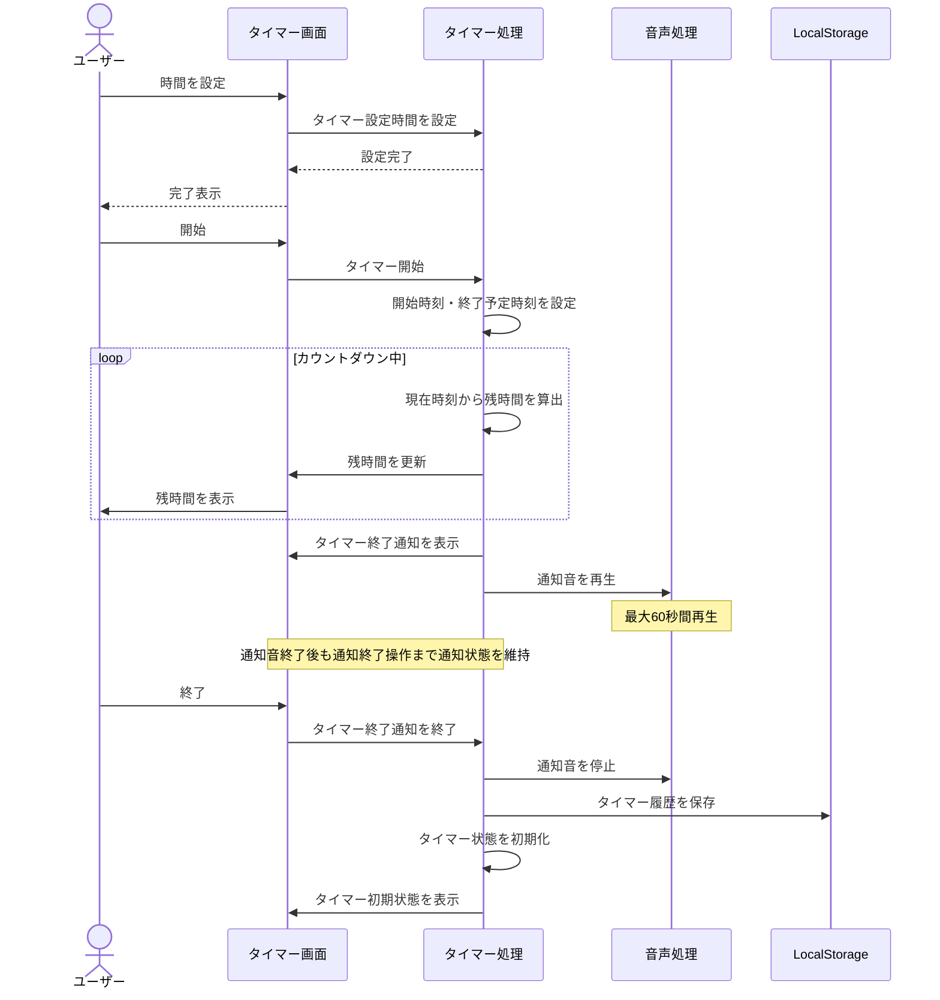
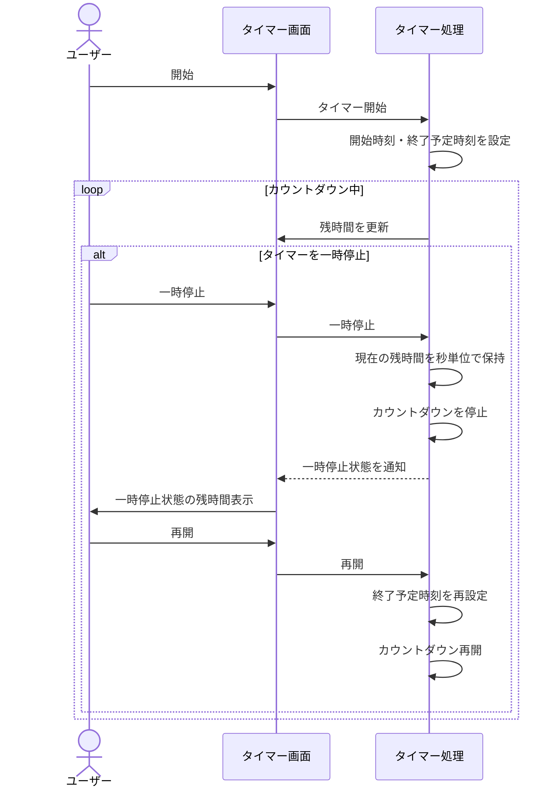
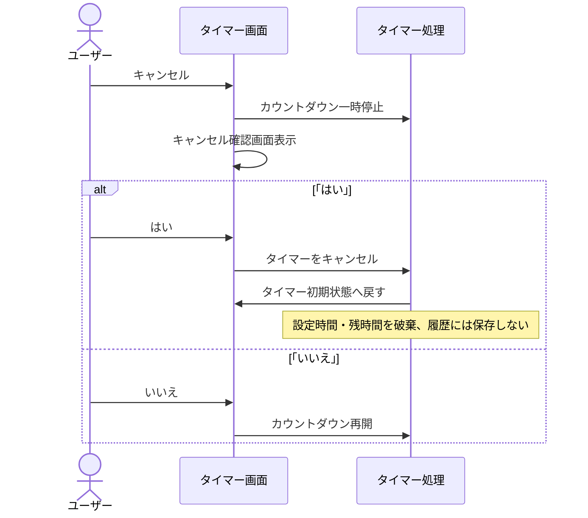
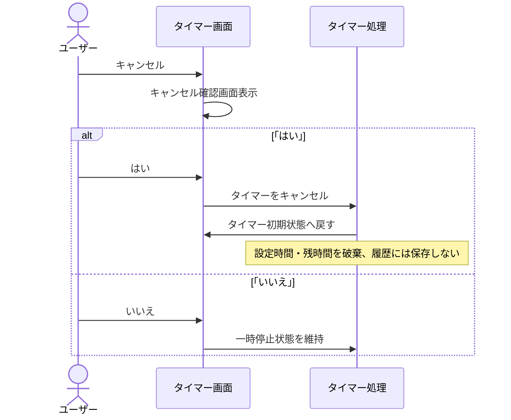
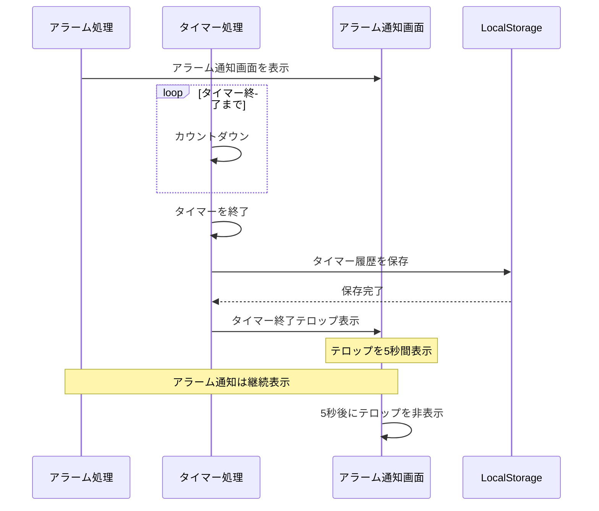
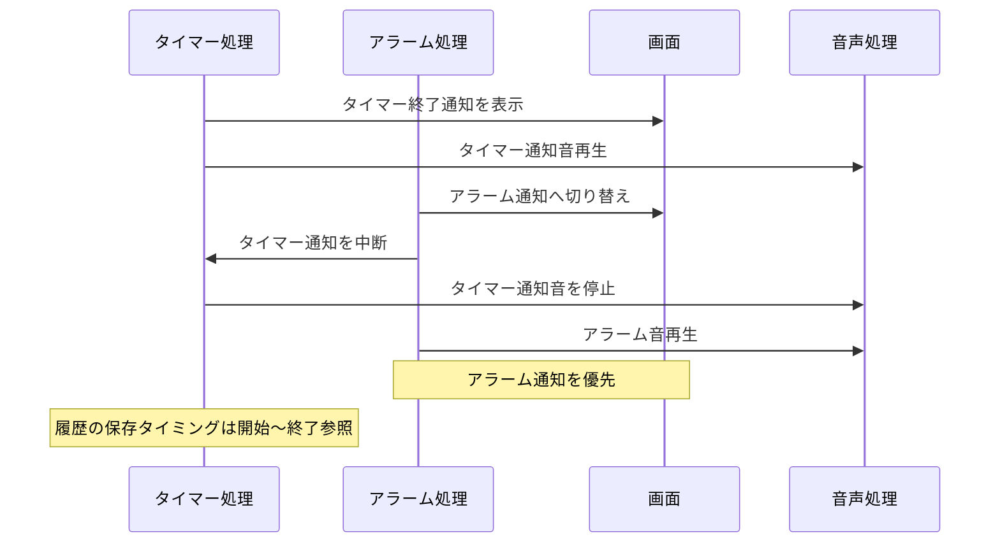

# タイマーシーケンス図
## 1. タイマー開始～終了（通常ケース）

```mermaid
sequenceDiagram
    actor ユーザー
    participant UI as タイマー画面
    participant Timer as タイマー処理
    participant Audio as 音声処理
    participant Storage as LocalStorage

    ユーザー->>UI: 時間を設定
    UI->>Timer: タイマー設定時間を設定
    Timer-->>UI: 設定完了
    UI-->>ユーザー: 完了表示

    ユーザー->>UI: 開始
    UI->>Timer: タイマー開始
    Timer->>Timer: 開始時刻・終了予定時刻を設定

    loop カウントダウン中
        Timer->>Timer: 現在時刻から残時間を算出
        Timer->>UI: 残時間を更新
        UI->>ユーザー: 残時間を表示
    end

    Timer->>UI: タイマー終了通知を表示
    Timer->>Audio: 通知音を再生

    Note over Audio: 最大60秒間再生
    Note over Timer,UI: 通知音終了後も通知終了操作まで通知状態を維持

    ユーザー->>UI: 終了
    UI->>Timer: タイマー終了通知を終了

    Timer->>Audio: 通知音を停止
    Timer->>Storage: タイマー履歴を保存

    Timer->>Timer: タイマー状態を初期化
    Timer->>UI: タイマー初期状態を表示
```

## 2. タイマー一時停止・再開

```mermaid
sequenceDiagram
    actor ユーザー
    participant UI as タイマー画面
    participant Timer as タイマー処理

    ユーザー->>UI: 開始
    UI->>Timer: タイマー開始
    Timer->>Timer: 開始時刻・終了予定時刻を設定

    loop カウントダウン中
        Timer->>UI: 残時間を更新

        alt タイマーを一時停止
            ユーザー->>UI: 一時停止
            UI->>Timer: 一時停止
            Timer->>Timer: 現在の残時間を秒単位で保持
            Timer->>Timer: カウントダウンを停止
            Timer-->>UI: 一時停止状態を通知
            UI->>ユーザー: 一時停止状態の残時間表示

            ユーザー->>UI: 再開
            UI->>Timer: 再開
            Timer->>Timer: 終了予定時刻を再設定
            Timer->>Timer: カウントダウン再開
        end
    end
```

## 3. タイマーカウントダウン中キャンセル

```mermaid
sequenceDiagram
    actor ユーザー
    participant UI as タイマー画面
    participant Timer as タイマー処理

    ユーザー->>UI: キャンセル
    UI->>Timer: カウントダウン一時停止
    UI->>UI: キャンセル確認画面表示

    alt 「はい」
        ユーザー->>UI: はい
        UI->>Timer: タイマーをキャンセル
        Timer->>UI: タイマー初期状態へ戻す
        Note over Timer: 設定時間・残時間を破棄、履歴には保存しない
    else 「いいえ」
        ユーザー->>UI: いいえ
        UI->>Timer: カウントダウン再開
    end
```
## 4. タイマー一時停止中キャンセル

```mermaid
sequenceDiagram
    actor ユーザー
    participant UI as タイマー画面
    participant Timer as タイマー処理

    ユーザー->>UI: キャンセル
    UI->>UI: キャンセル確認画面表示

    alt 「はい」
        ユーザー->>UI: はい
        UI->>Timer: タイマーをキャンセル
        Timer->>UI: タイマー初期状態へ戻す
        Note over Timer: 設定時間・残時間を破棄、履歴には保存しない
    else 「いいえ」
        ユーザー->>UI: いいえ
        UI->>Timer: 一時停止状態を維持
    end
```

## 5. アラーム通知中_タイマー終了

```mermaid
sequenceDiagram

    participant Alarm as アラーム処理
    participant Timer as タイマー処理
    participant UI as アラーム通知画面
    participant Storage as LocalStorage

    Alarm->>UI: アラーム通知画面を表示

    loop タイマー終了まで
        Timer->>Timer: カウントダウン
    end

    Timer->>Timer: タイマーを終了
    Timer->>Storage: タイマー履歴を保存
    Storage-->>Timer: 保存完了

    Timer->>UI: タイマー終了テロップ表示

    Note over UI: テロップを5秒間表示
    Note over Alarm,UI: アラーム通知は継続表示

    UI->>UI: 5秒後にテロップを非表示
```

## 6. タイマー通知中_アラーム通知

```mermaid
sequenceDiagram
    participant Timer as タイマー処理
    participant Alarm as アラーム処理
    participant UI as 画面
    participant Audio as 音声処理

    Timer->>UI: タイマー終了通知を表示
    Timer->>Audio: タイマー通知音再生

    Alarm->>UI: アラーム通知へ切り替え
    Alarm->>Timer: タイマー通知を中断
    Timer->>Audio: タイマー通知音を停止
    Alarm->>Audio: アラーム音再生

    Note over Alarm,UI: アラーム通知を優先

    Note over Timer: 履歴の保存タイミングは開始～終了参照
```
