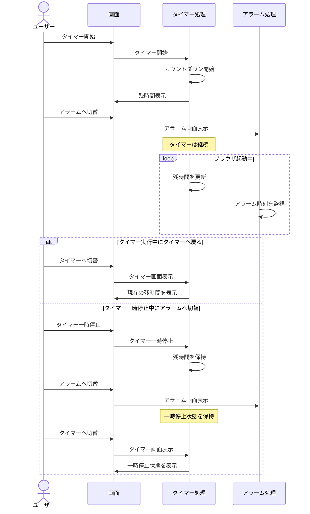
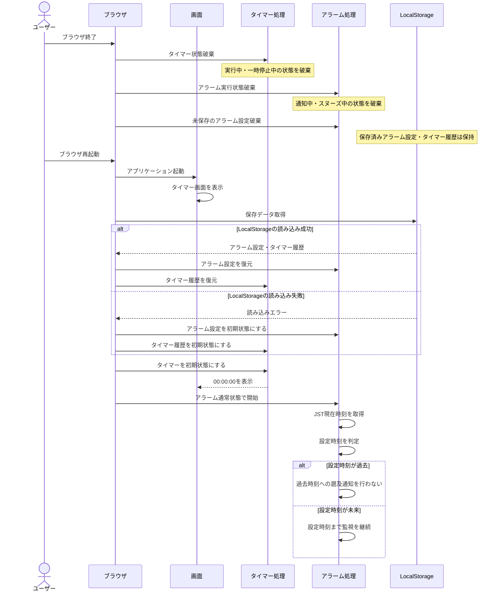
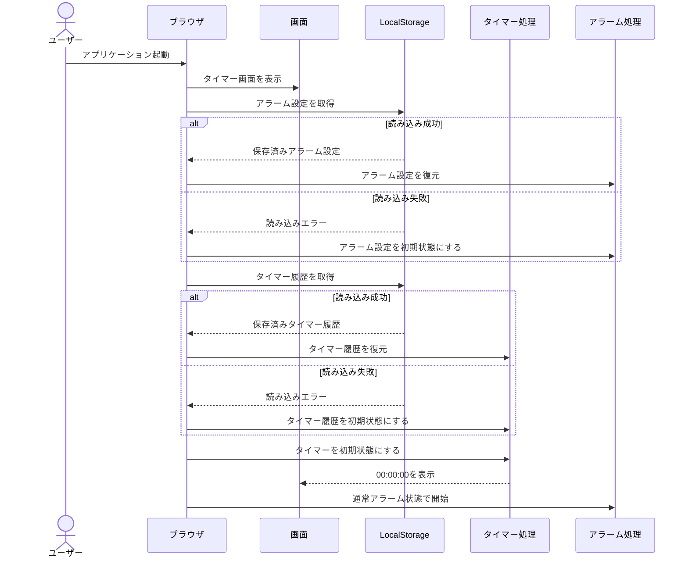

# 共通シーケンス図

## 1. モード切替中のタイマー・アラーム

```mermaid
sequenceDiagram
    actor ユーザー
    participant UI as 画面
    participant Timer as タイマー処理
    participant Alarm as アラーム処理

    ユーザー->>UI: タイマー開始
    UI->>Timer: タイマー開始
    Timer->>Timer: カウントダウン開始
    Timer->>UI: 残時間表示

    ユーザー->>UI: アラームへ切替
    UI->>Alarm: アラーム画面表示
    Note over Timer: タイマーは継続

    loop ブラウザ起動中
        Timer->>Timer: 残時間を更新
        Alarm->>Alarm: アラーム時刻を監視
    end

    alt タイマー実行中にタイマーへ戻る
        ユーザー->>UI: タイマーへ切替
        UI->>Timer: タイマー画面表示
        Timer->>UI: 現在の残時間を表示

    else タイマー一時停止中にアラームへ切替
        ユーザー->>UI: タイマー一時停止
        UI->>Timer: タイマー一時停止
        Timer->>Timer: 残時間を保持

        ユーザー->>UI: アラームへ切替
        UI->>Alarm: アラーム画面表示
        Note over Timer: 一時停止状態を保持

        ユーザー->>UI: タイマーへ切替
        UI->>Timer: タイマー画面表示
        Timer->>UI: 一時停止状態を表示
    end
```

この図では、**モード切替は表示画面だけを変更し、タイマーやアラームの内部状態は変更しない**ことを表しています。

---

## 2. ブラウザ終了・再起動

```mermaid
sequenceDiagram
    actor ユーザー
    participant Browser as ブラウザ
    participant UI as 画面
    participant Timer as タイマー処理
    participant Alarm as アラーム処理
    participant Storage as LocalStorage

    ユーザー->>Browser: ブラウザ終了

    Browser->>Timer: タイマー状態破棄
    Note over Timer: 実行中・一時停止中の状態を破棄

    Browser->>Alarm: アラーム実行状態破棄
    Note over Alarm: 通知中・スヌーズ中の状態を破棄

    Browser->>Alarm: 未保存のアラーム設定破棄
    Note over Storage: 保存済みアラーム設定・タイマー履歴は保持

    ユーザー->>Browser: ブラウザ再起動
    Browser->>UI: アプリケーション起動

    UI->>UI: タイマー画面を表示

    Browser->>Storage: 保存データ取得

    alt LocalStorageの読み込み成功
        Storage-->>Browser: アラーム設定・タイマー履歴
        Browser->>Alarm: アラーム設定を復元
        Browser->>Timer: タイマー履歴を復元

    else LocalStorageの読み込み失敗
        Storage-->>Browser: 読み込みエラー
        Browser->>Alarm: アラーム設定を初期状態にする
        Browser->>Timer: タイマー履歴を初期状態にする
    end

    Browser->>Timer: タイマーを初期状態にする
    Timer-->>UI: 00:00:00を表示

    Browser->>Alarm: アラーム通常状態で開始
    Alarm->>Alarm: JST現在時刻を取得
    Alarm->>Alarm: 設定時刻を判定

    alt 設定時刻が過去
        Alarm->>Alarm: 過去時刻への遡及通知を行わない
    else 設定時刻が未来
        Alarm->>Alarm: 設定時刻まで監視を継続
    end
```

---

## 3. アプリケーション起動時の状態復元

```mermaid
sequenceDiagram
    actor ユーザー
    participant Browser as ブラウザ
    participant UI as 画面
    participant Storage as LocalStorage
    participant Timer as タイマー処理
    participant Alarm as アラーム処理

    ユーザー->>Browser: アプリケーション起動
    Browser->>UI: タイマー画面を表示

    Browser->>Storage: アラーム設定を取得

    alt 読み込み成功
        Storage-->>Browser: 保存済みアラーム設定
        Browser->>Alarm: アラーム設定を復元
    else 読み込み失敗
        Storage-->>Browser: 読み込みエラー
        Browser->>Alarm: アラーム設定を初期状態にする
    end

    Browser->>Storage: タイマー履歴を取得

    alt 読み込み成功
        Storage-->>Browser: 保存済みタイマー履歴
        Browser->>Timer: タイマー履歴を復元
    else 読み込み失敗
        Storage-->>Browser: 読み込みエラー
        Browser->>Timer: タイマー履歴を初期状態にする
    end

    Browser->>Timer: タイマーを初期状態にする
    Timer-->>UI: 00:00:00を表示

    Browser->>Alarm: 通常アラーム状態で開始
```
