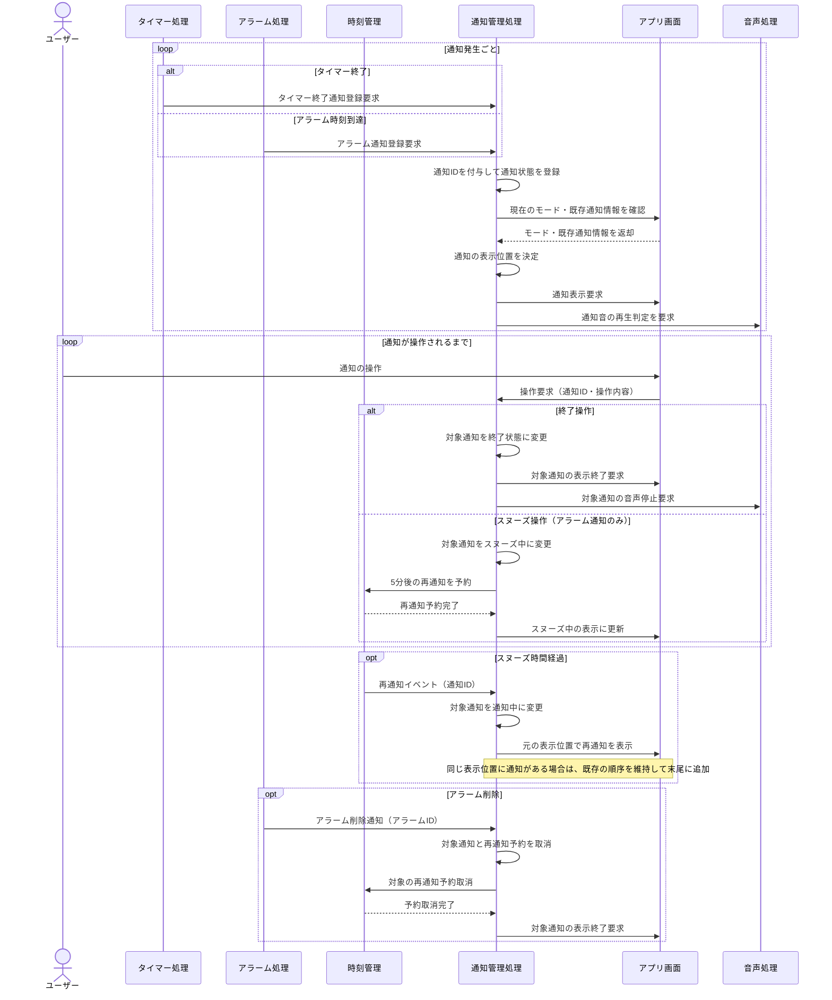
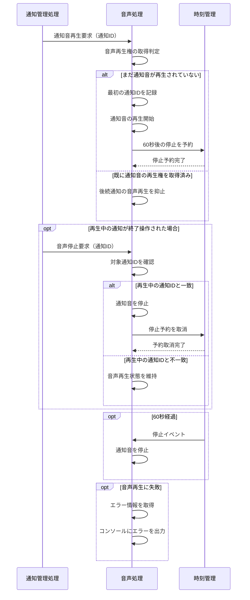
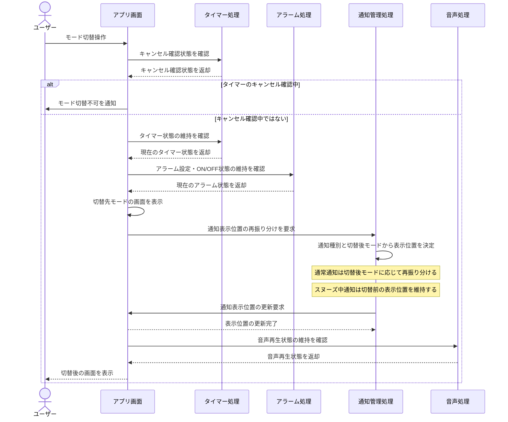
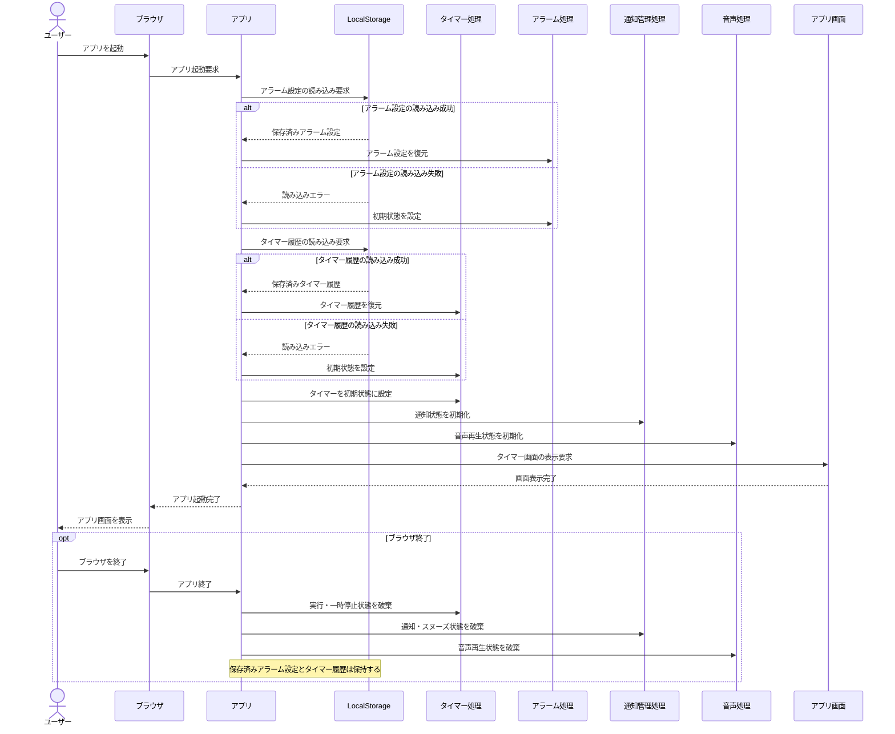

# 共通シーケンス図
## 1. 共通通知管理

```mermaid
sequenceDiagram
    actor User as ユーザー
    participant Timer as タイマー処理
    participant Alarm as アラーム処理
    participant Clock as 時刻管理
    participant Notify as 通知管理処理
    participant UI as アプリ画面
    participant Audio as 音声処理

    loop 通知発生ごと
        alt タイマー終了
            Timer->>Notify: タイマー終了通知登録要求
        else アラーム時刻到達
            Alarm->>Notify: アラーム通知登録要求
        end

        Notify->>Notify: 通知IDを付与して通知状態を登録
        Notify->>UI: 現在のモード・既存通知情報を確認
        UI-->>Notify: モード・既存通知情報を返却
        Notify->>Notify: 通知の表示位置を決定
        Notify->>UI: 通知表示要求
        Notify->>Audio: 通知音の再生判定を要求
    end

    loop 通知が操作されるまで
        User->>UI: 通知の操作
        UI->>Notify: 操作要求（通知ID・操作内容）

        alt 終了操作
            Notify->>Notify: 対象通知を終了状態に変更
            Notify->>UI: 対象通知の表示終了要求
            Notify->>Audio: 対象通知の音声停止要求

        else スヌーズ操作（アラーム通知のみ）
            Notify->>Notify: 対象通知をスヌーズ中に変更
            Notify->>Clock: 5分後の再通知を予約
            Clock-->>Notify: 再通知予約完了
            Notify->>UI: スヌーズ中の表示に更新
        end
    end

    opt スヌーズ時間経過
        Clock->>Notify: 再通知イベント（通知ID）
        Notify->>Notify: 対象通知を通知中に変更
        Notify->>UI: 元の表示位置で再通知を表示
        Note over Notify,UI: 同じ表示位置に通知がある場合は、既存の順序を維持して末尾に追加
    end

    opt アラーム削除
        Alarm->>Notify: アラーム削除通知（アラームID）
        Notify->>Notify: 対象通知と再通知予約を取消
        Notify->>Clock: 対象の再通知予約取消
        Clock-->>Notify: 予約取消完了
        Notify->>UI: 対象通知の表示終了要求
    end
```
## 2. 共通通知音管理

```mermaid
sequenceDiagram
    participant Notify as 通知管理処理
    participant Audio as 音声処理
    participant Clock as 時刻管理

    Notify->>Audio: 通知音再生要求（通知ID）
    Audio->>Audio: 音声再生権の取得判定

    alt まだ通知音が再生されていない
        Audio->>Audio: 最初の通知IDを記録
        Audio->>Audio: 通知音の再生開始
        Audio->>Clock: 60秒後の停止を予約
        Clock-->>Audio: 停止予約完了
    else 既に通知音の再生権を取得済み
        Audio->>Audio: 後続通知の音声再生を抑止
    end

    opt 再生中の通知が終了操作された場合
        Notify->>Audio: 音声停止要求（通知ID）
        Audio->>Audio: 対象通知IDを確認

        alt 再生中の通知IDと一致
            Audio->>Audio: 通知音を停止
            Audio->>Clock: 停止予約を取消
            Clock-->>Audio: 予約取消完了
        else 再生中の通知IDと不一致
            Audio->>Audio: 音声再生状態を維持
        end
    end

    opt 60秒経過
        Clock->>Audio: 停止イベント
        Audio->>Audio: 通知音を停止
    end

    opt 音声再生に失敗
        Audio->>Audio: エラー情報を取得
        Audio->>Audio: コンソールにエラーを出力
    end
```

## 3. 共通モード切替

```mermaid
sequenceDiagram
    actor User as ユーザー
    participant UI as アプリ画面
    participant Timer as タイマー処理
    participant Alarm as アラーム処理
    participant Notify as 通知管理処理
    participant Audio as 音声処理

    User->>UI: モード切替操作
    UI->>Timer: キャンセル確認状態を確認
    Timer-->>UI: キャンセル確認状態を返却

    alt タイマーのキャンセル確認中
        UI->>User: モード切替不可を通知
    else キャンセル確認中ではない
        UI->>Timer: タイマー状態の維持を確認
        Timer-->>UI: 現在のタイマー状態を返却

        UI->>Alarm: アラーム設定・ON/OFF状態の維持を確認
        Alarm-->>UI: 現在のアラーム状態を返却

        UI->>UI: 切替先モードの画面を表示

        UI->>Notify: 通知表示位置の再振り分けを要求
        Notify->>Notify: 通知種別と切替後モードから表示位置を決定
        Note over Notify: 通常通知は切替後モードに応じて再振り分ける
        Note over Notify: スヌーズ中通知は切替前の表示位置を維持する
        Notify->>UI: 通知表示位置の更新要求
        UI-->>Notify: 表示位置の更新完了

        UI->>Audio: 音声再生状態の維持を確認
        Audio-->>UI: 音声再生状態を返却

        UI-->>User: 切替後の画面を表示
    end
```

## 4. ブラウザ終了・再起動

```mermaid
sequenceDiagram
    actor User as ユーザー
    participant Browser as ブラウザ
    participant App as アプリ
    participant Storage as LocalStorage
    participant Timer as タイマー処理
    participant Alarm as アラーム処理
    participant Notify as 通知管理処理
    participant Audio as 音声処理
    participant UI as アプリ画面

    User->>Browser: アプリを起動
    Browser->>App: アプリ起動要求
    App->>Storage: アラーム設定の読み込み要求

    alt アラーム設定の読み込み成功
        Storage-->>App: 保存済みアラーム設定
        App->>Alarm: アラーム設定を復元
    else アラーム設定の読み込み失敗
        Storage-->>App: 読み込みエラー
        App->>Alarm: 初期状態を設定
    end

    App->>Storage: タイマー履歴の読み込み要求

    alt タイマー履歴の読み込み成功
        Storage-->>App: 保存済みタイマー履歴
        App->>Timer: タイマー履歴を復元
    else タイマー履歴の読み込み失敗
        Storage-->>App: 読み込みエラー
        App->>Timer: 初期状態を設定
    end

    App->>Timer: タイマーを初期状態に設定
    App->>Notify: 通知状態を初期化
    App->>Audio: 音声再生状態を初期化
    App->>UI: タイマー画面の表示要求
    UI-->>App: 画面表示完了
    App-->>Browser: アプリ起動完了
    Browser-->>User: アプリ画面を表示

    opt ブラウザ終了
        User->>Browser: ブラウザを終了
        Browser->>App: アプリ終了
        App->>Timer: 実行・一時停止状態を破棄
        App->>Notify: 通知・スヌーズ状態を破棄
        App->>Audio: 音声再生状態を破棄
        Note over App,Storage: 保存済みアラーム設定とタイマー履歴は保持する
    end
```