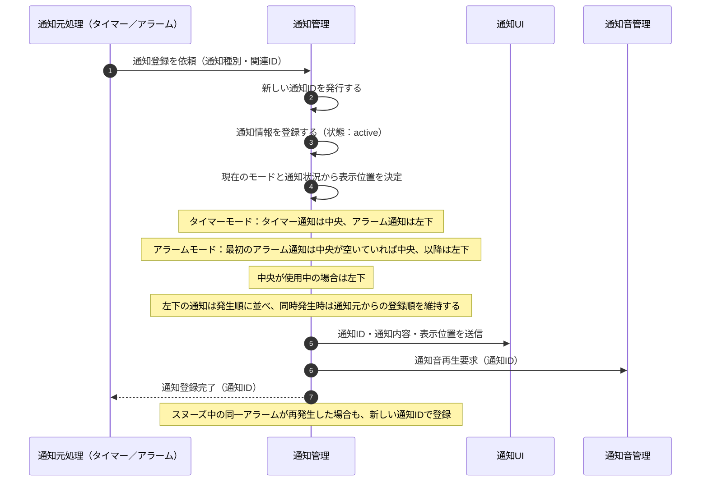
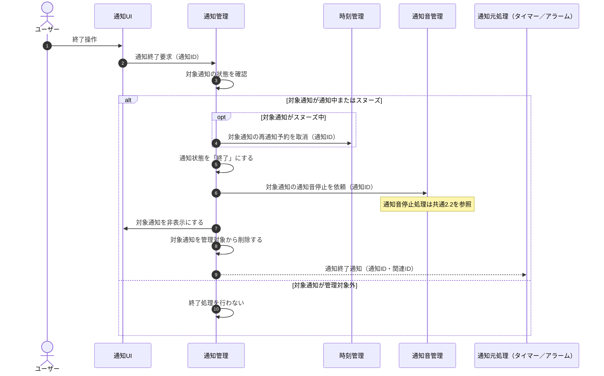
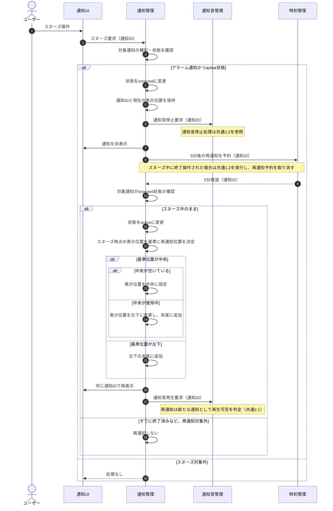
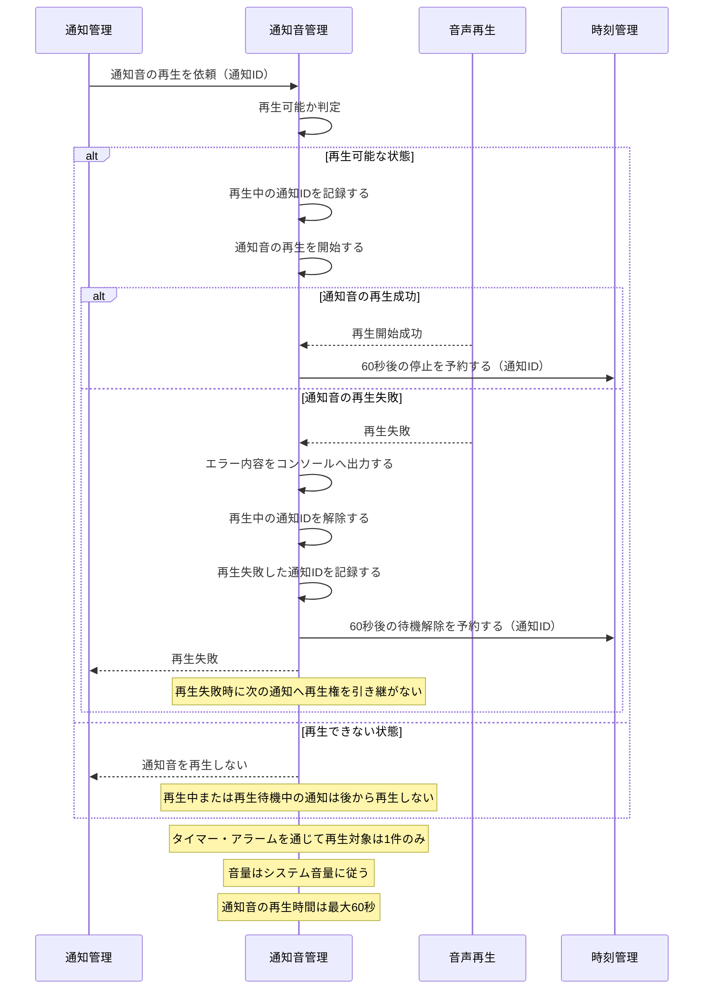
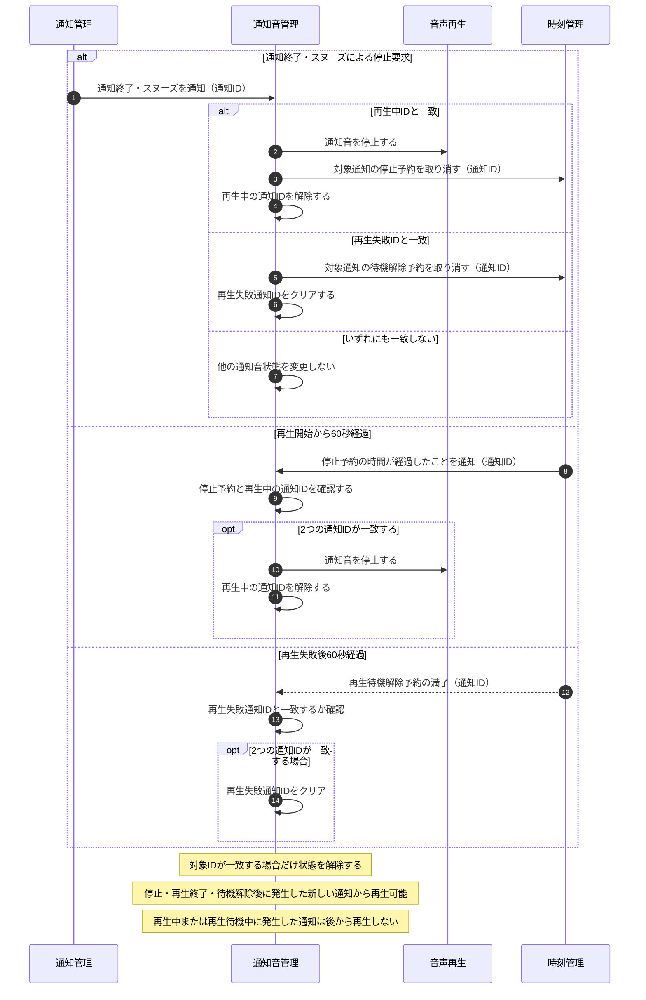
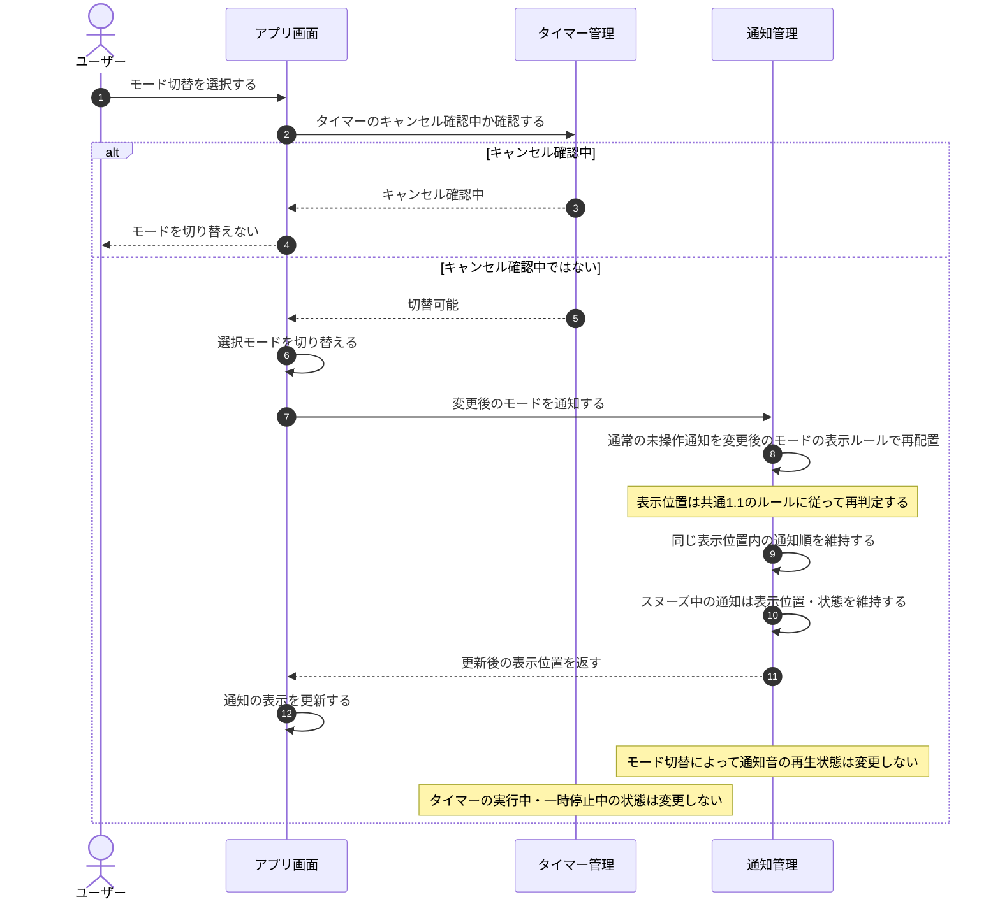
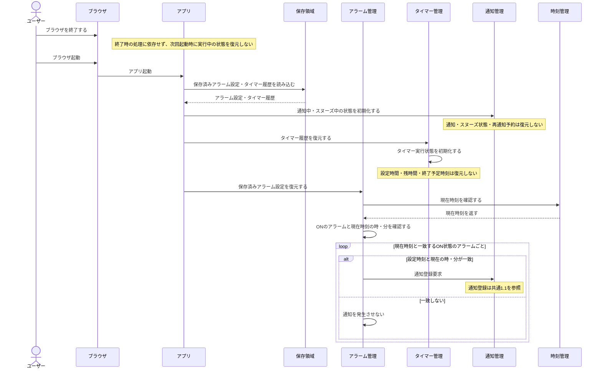

# 共通シーケンス図
## 1. 共通通知管理
### 1.1 通知登録・表示位置決定

```mermaid
sequenceDiagram
    autonumber
    participant Source as 通知元処理（タイマー／アラーム）
    participant Notify as 通知管理
    participant UI as 通知UI
    participant Audio as 通知音管理

    Source->>Notify: 通知登録を依頼（通知種別・関連ID）
    Notify->>Notify: 新しい通知IDを発行する
    Notify->>Notify: 通知情報を登録する（状態：active）
    Notify->>Notify: 現在のモードと通知状況から表示位置を決定

    Note over Notify: タイマーモード：タイマー通知は中央、アラーム通知は左下
    Note over Notify: アラームモード：最初のアラーム通知は中央が空いていれば中央、以降は左下
    Note over Notify: 中央が使用中の場合は左下
    Note over Notify: 左下の通知は発生順に並べ、同時発生時は通知元からの登録順を維持する

    Notify->>UI: 通知ID・通知内容・表示位置を送信
    Notify->>Audio: 通知音再生要求（通知ID）
    Notify-->>Source: 通知登録完了（通知ID）

    Note over Notify: スヌーズ中の同一アラームが再発生した場合も、新しい通知IDで登録
```
### 1.2 通知終了

```mermaid
sequenceDiagram
    autonumber
    actor User as ユーザー
    participant UI as 通知UI
    participant Notify as 通知管理
    participant Clock as 時刻管理
    participant Audio as 通知音管理
    participant Source as 通知元処理（タイマー／アラーム）

    User->>UI: 終了操作
    UI->>Notify: 通知終了要求（通知ID）

    Notify->>Notify: 対象通知の状態を確認

    alt 対象通知が通知中またはスヌーズ
        opt 対象通知がスヌーズ中
            Notify->>Clock: 対象通知の再通知予約を取消（通知ID）
        end

        Notify->>Notify: 通知状態を「終了」にする
        Notify->>Audio: 対象通知の通知音停止を依頼（通知ID）
        Note over Audio: 通知音停止処理は共通2.2を参照
        Notify->>UI: 対象通知を非表示にする
        Notify->>Notify: 対象通知を管理対象から削除する
        Notify-->>Source: 通知終了通知（通知ID・関連ID）
    else 対象通知が管理対象外
        Notify->>Notify: 終了処理を行わない
    end
```
### 1.3 スヌーズ・再通知

```mermaid
sequenceDiagram
    autonumber
    actor User as ユーザー
    participant UI as 通知UI
    participant Notify as 通知管理
    participant Audio as 通知音管理
    participant Clock as 時刻管理

    User->>UI: スヌーズ操作
    UI->>Notify: スヌーズ要求（通知ID）

    Notify->>Notify: 対象通知の種別・状態を確認

    alt アラーム通知かつactive状態
        Notify->>Notify: 状態をsnoozedに変更
        Notify->>Notify: 通知IDと現在の表示位置を保持
        Notify->>Audio: 通知音停止要求（通知ID）
        Note over Audio: 通知音停止処理は共通2.2を参照
        Notify->>UI: 通知を非表示
        Notify->>Clock: 5分後の再通知を予約（通知ID）

        Note over Notify,Clock: スヌーズ中に終了操作された場合は共通1.2を実行し、再通知予約を取り消す

        Clock-->>Notify: 5分経過（通知ID）
        Notify->>Notify: 対象通知がsnoozed状態か確認

        alt スヌーズ中のまま
            Notify->>Notify: 状態をactiveに変更
            Notify->>Notify: スヌーズ時点の表示位置を基準に再通知位置を決定

            alt 基準位置が中央
                alt 中央が空いている
                    Notify->>Notify: 表示位置を中央に設定
                else 中央が使用中
                    Notify->>Notify: 表示位置を左下に変更し、末尾に追加
                end
            else 基準位置が左下
                Notify->>Notify: 左下の末尾に追加
            end

            Notify->>UI: 同じ通知IDで再表示
            Notify->>Audio: 通知音再生要求（通知ID）
            Note over Audio: 再通知は新たな通知として再生可否を判定（共通2.1）
        else すでに終了済みなど、再通知対象外
            Notify->>Notify: 再通知しない
        end
    else スヌーズ対象外
        Notify-->>UI: 処理なし
    end
```

## 2. 共通通知音管理
### 2.1 通知音の再生判定・開始

```mermaid
sequenceDiagram
    participant Notify as 通知管理
    participant Audio as 通知音管理
    participant Player as 音声再生
    participant Clock as 時刻管理

    Notify->>Audio: 通知音の再生を依頼（通知ID）
    Audio->>Audio: 再生可能か判定

    alt 再生可能な状態
        Audio->>Audio: 再生中の通知IDを記録する
        Audio->>Audio: 通知音の再生を開始する

        alt 通知音の再生成功
            Player-->>Audio: 再生開始成功
            Audio->>Clock: 60秒後の停止を予約する（通知ID）
        else 通知音の再生失敗
            Player-->>Audio: 再生失敗
            Audio->>Audio: エラー内容をコンソールへ出力する
            Audio->>Audio: 再生中の通知IDを解除する
            Audio->>Audio: 再生失敗した通知IDを記録する
            Audio->>Clock: 60秒後の待機解除を予約する（通知ID）
            Audio-->>Notify: 再生失敗
            Note over Audio: 再生失敗時に次の通知へ再生権を引き継がない
        end

    else 再生できない状態
        Audio-->>Notify: 通知音を再生しない
        Note over Audio: 再生中または再生待機中の通知は後から再生しない
    end

    Note over Audio: タイマー・アラームを通じて再生対象は1件のみ
    Note over Audio: 音量はシステム音量に従う
    Note over Audio: 通知音の再生時間は最大60秒
```

### 2.2 通知音の停止・再生時間・失敗管理

```mermaid
sequenceDiagram
    autonumber
    participant Notify as 通知管理
    participant Audio as 通知音管理
    participant Player as 音声再生
    participant Clock as 時刻管理

    alt 通知終了・スヌーズによる停止要求
        Notify->>Audio: 通知終了・スヌーズを通知（通知ID）

        alt 再生中IDと一致
            Audio->>Player: 通知音を停止する
            Audio->>Clock: 対象通知の停止予約を取り消す（通知ID）
            Audio->>Audio: 再生中の通知IDを解除する
        else 再生失敗IDと一致
            Audio->>Clock: 対象通知の待機解除予約を取り消す（通知ID）
            Audio->>Audio: 再生失敗通知IDをクリアする
        else いずれにも一致しない
            Audio->>Audio: 他の通知音状態を変更しない
        end

    else 再生開始から60秒経過
        Clock->>Audio: 停止予約の時間が経過したことを通知（通知ID）
        Audio->>Audio: 停止予約と再生中の通知IDを確認する

        opt 2つの通知IDが一致する
            Audio->>Player: 通知音を停止する
            Audio->>Audio: 再生中の通知IDを解除する
        end

    else 再生失敗後60秒経過
        Clock-->>Audio: 再生待機解除予約の満了（通知ID）
        Audio->>Audio: 再生失敗通知IDと一致するか確認
        opt 2つの通知IDが一致する場合
            Audio->>Audio: 再生失敗通知IDをクリア
        end
    end

    Note over Audio: 対象IDが一致する場合だけ状態を解除する
    Note over Audio: 停止・再生終了・待機解除後に発生した新しい通知から再生可能
    Note over Audio: 再生中または再生待機中に発生した通知は後から再生しない
```

## 3. 共通モード切替

```mermaid
sequenceDiagram
    autonumber
    actor User as ユーザー
    participant UI as アプリ画面
    participant Timer as タイマー管理
    participant Notify as 通知管理

    User->>UI: モード切替を選択する
    UI->>Timer: タイマーのキャンセル確認中か確認する

    alt キャンセル確認中
        Timer-->>UI: キャンセル確認中
        UI-->>User: モードを切り替えない

    else キャンセル確認中ではない
        Timer-->>UI: 切替可能
        UI->>UI: 選択モードを切り替える
        UI->>Notify: 変更後のモードを通知する

        Notify->>Notify: 通常の未操作通知を変更後のモードの表示ルールで再配置
        Note over Notify: 表示位置は共通1.1のルールに従って再判定する
        Notify->>Notify: 同じ表示位置内の通知順を維持する
        Notify->>Notify: スヌーズ中の通知は表示位置・状態を維持する
        Notify-->>UI: 更新後の表示位置を返す
        UI->>UI: 通知の表示を更新する

        Note over Notify: モード切替によって通知音の再生状態は変更しない
        Note over Timer: タイマーの実行中・一時停止中の状態は変更しない
    end
```

## 4. ブラウザ終了・再起動

```mermaid
sequenceDiagram
    actor User as ユーザー
    participant Browser as ブラウザ
    participant App as アプリ
    participant Storage as 保存領域
    participant Alarm as アラーム管理
    participant Timer as タイマー管理
    participant Notify as 通知管理
    participant Clock as 時刻管理

    User->>Browser: ブラウザを終了する
    Note over App: 終了時の処理に依存せず、次回起動時に実行中の状態を復元しない

    User->>Browser: ブラウザ起動
    Browser->>App: アプリ起動
    App->>Storage: 保存済みアラーム設定・タイマー履歴を読み込む
    Storage-->>App: アラーム設定・タイマー履歴

    App->>Notify: 通知中・スヌーズ中の状態を初期化する
    Note over Notify: 通知・スヌーズ状態・再通知予約は復元しない

    App->>Timer: タイマー履歴を復元する
    Timer->>Timer: タイマー実行状態を初期化する
    Note over Timer: 設定時間・残時間・終了予定時刻は復元しない

    App->>Alarm: 保存済みアラーム設定を復元する
    Alarm->>Clock: 現在時刻を確認する
    Clock-->>Alarm: 現在時刻を返す

    Alarm->>Alarm: ONのアラームと現在時刻の時・分を確認する

    loop 現在時刻と一致するON状態のアラームごと
        alt 設定時刻と現在の時・分が一致
            Alarm->>Notify: 通知登録要求
            Note over Notify: 通知登録は共通1.1を参照
        else 一致しない
            Alarm->>Alarm: 通知を発生させない
        end
    end
```