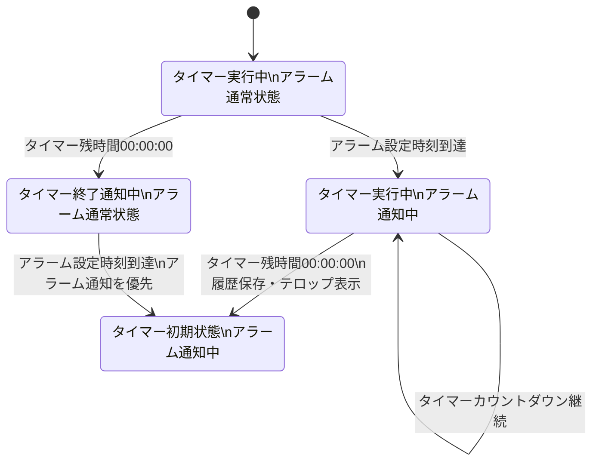

<!-- タイマー＋アラーム統合状態遷移図 -->

stateDiagram-v2
    [*] --> 通常状態

    state "タイマー状態" as Timer {
        [*] --> タイマー初期
        タイマー初期 --> タイマー設定中 : 時間設定
        タイマー設定中 --> タイマー実行中 : 開始
        タイマー実行中 --> タイマー一時停止中 : 一時停止
        タイマー一時停止中 --> タイマー実行中 : 再開

        タイマー実行中 --> キャンセル確認中 : キャンセル
        タイマー一時停止中 --> キャンセル確認中 : キャンセル

        キャンセル確認中 --> タイマー初期 : はい
        キャンセル確認中 --> タイマー実行中 : いいえ（実行中）
        キャンセル確認中 --> タイマー一時停止中 : いいえ（一時停止中）

        タイマー実行中 --> タイマー終了通知中 : 残時間0秒
        タイマー終了通知中 --> タイマー初期 : 終了
    }

    state "アラーム状態" as Alarm {
        [*] --> アラーム通常

        アラーム通常 --> アラーム設定中 : 追加
        アラーム設定中 --> アラーム通常 : 保存

        アラーム通常 --> アラーム通知中 : 設定時刻到達
        アラーム通知中 --> アラーム通常 : 終了
        アラーム通知中 --> スヌーズ中 : スヌーズ
        スヌーズ中 --> アラーム通知中 : 5分経過
        スヌーズ中 --> アラーム通常 : 終了
    }

    通常状態 --> Timer
    通常状態 --> Alarm